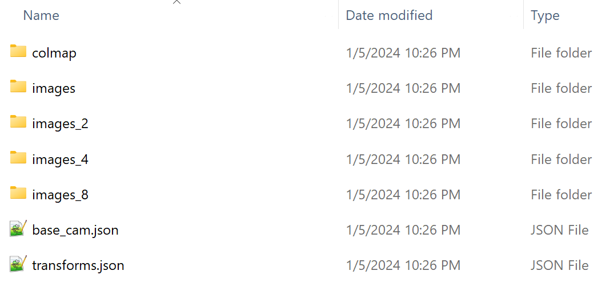
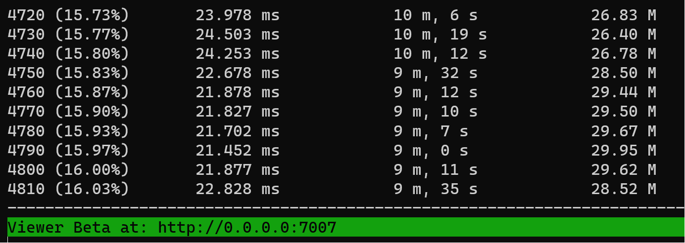
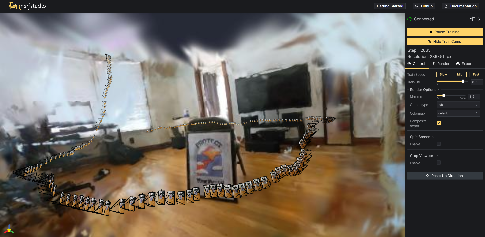

# An Unofficial Guide to Gaussian Splatting for Nerfstudio

### Read first
__This is a forked tutorial guide and the main codes will not be updated__

This forked GitHub project is intented for folks who have little to know command-line knowledge and want to run Nerfstudio to create gaussian splats. If you have used Instant NGP, Nerfstudio, or other similar command-line based radiance field projects, most likely you have already installed some or all of the depedencies required for this project.

I created two walkthrough videos to compliment the tutorial (coming soon). You can watch them independently or with this project page as reference. Please follow my YT channel for additional updates. Now let's get gaussian splatting with Nerfstudio!

The section below is from the original GitHub page. Jump down to "Start Here" for the actual tutorial. <br>
<br>
<br>


# About Nerfstudio

_It’s as simple as plug and play with nerfstudio!_

Nerfstudio provides a simple API that allows for a simplified end-to-end process of creating, training, and testing NeRFs.
The library supports a **more interpretable implementation of NeRFs by modularizing each component.**
With more modular NeRFs, we hope to create a more user-friendly experience in exploring the technology.

This is a contributor-friendly repo with the goal of building a community where users can more easily build upon each other's contributions.
Nerfstudio initially launched as an opensource project by Berkeley students in [KAIR lab](https://people.eecs.berkeley.edu/~kanazawa/index.html#kair) at [Berkeley AI Research (BAIR)](https://bair.berkeley.edu/) in October 2022 as a part of a research project ([paper](https://arxiv.org/abs/2302.04264)). It is currently developed by Berkeley students and community contributors.

We are committed to providing learning resources to help you understand the basics of (if you're just getting started), and keep up-to-date with (if you're a seasoned veteran) all things NeRF. As researchers, we know just how hard it is to get onboarded with this next-gen technology. So we're here to help with tutorials, documentation, and more!

Have feature requests? Want to add your brand-spankin'-new NeRF model? Have a new dataset? **We welcome [contributions](https://docs.nerf.studio/reference/contributing.html)!** Please do not hesitate to reach out to the nerfstudio team with any questions via [Discord](https://discord.gg/uMbNqcraFc).

Have feedback? We'd love for you to fill out our [Nerfstudio Feedback Form](https://forms.gle/sqN5phJN7LfQVwnP9) if you want to let us know who you are, why you are interested in Nerfstudio, or provide any feedback!

We hope nerfstudio enables you to build faster :hammer: learn together :books: and contribute to our NeRF community :sparkling_heart:.
<br>
<br>

# Installation


## Prerequisites

You must have an NVIDIA video card with CUDA installed on the system. This library has been tested with version 11.8 of CUDA. You can find more information about installing CUDA [here](https://docs.nvidia.com/cuda/cuda-quick-start-guide/index.html)

Install [Git](https://git-scm.com/downloads).

Install [Visual Studio 2022](https://learn.microsoft.com/en-us/visualstudio/install/install-visual-studio?view=vs-2022). _This must be done before installing CUDA._ The necessary components are included in the `Desktop Development with C++` workflow (also called `C++ Build Tools` in the BuildTools edition).

Nerfstudio requires `python >= 3.8`. We recommend using conda to manage dependencies. Make sure to install [Conda](https://docs.conda.io/miniconda.html) before proceeding.

## Create environment

You will need to set up an environment on your PC to install dependencies and code. This next section will be completed primarily in command prompt. If you are new to command prompt, I suggest watching the installation video on my YouTube channel.

```bash
conda create --name nerfstudio -y python=3.8
conda activate nerfstudio
pip install --upgrade pip
```

## Dependencies

Install PyTorch with CUDA (this repo has been tested with CUDA 11.7 and CUDA 11.8) and [tiny-cuda-nn](https://github.com/NVlabs/tiny-cuda-nn).
`cuda-toolkit` is required for building `tiny-cuda-nn`.

You can check which version of CUDA Toolkit you have installed by entering `nvcc --version` into command prompt. Use the instructions below that match your version of CUDA Toolkit to install PyTorch.

For CUDA 11.7:

```bash
pip install torch==2.0.1+cu117 torchvision==0.15.2+cu117 --extra-index-url https://download.pytorch.org/whl/cu117

conda install -c "nvidia/label/cuda-11.7.1" cuda-toolkit
pip install ninja git+https://github.com/NVlabs/tiny-cuda-nn/#subdirectory=bindings/torch
```

For CUDA 11.8:

```bash
pip install torch==2.0.1+cu118 torchvision==0.15.2+cu118 --extra-index-url https://download.pytorch.org/whl/cu118

conda install -c "nvidia/label/cuda-11.8.0" cuda-toolkit
pip install ninja git+https://github.com/NVlabs/tiny-cuda-nn/#subdirectory=bindings/torch
```


## Installing nerfstudio

You will need to build Nerfstudio from source to access guassian splatting.

```bash
git clone https://github.com/nerfstudio-project/nerfstudio.git
cd nerfstudio
pip install --upgrade pip setuptools
pip install -e .
```

**Success! You have installed Nerfstudio!**


# Training your first gaussian splat

The following will teach you how to train a gaussian splat scene with default settings. This is trained to 30,000 steps.

## Launch the Nerfstudio environment
Open command prompt and start your Nerfstudio conda environment:
```bash
conda activate nerfstudio
```

path to the nerfstudio folder
```bash
cd nerfstudio
```

## Download image data

This this tutorial, we will use the open dataset provided by the Nerfstudio team. The following command will download an image set that is already prepared for training. 
```bash
ns-download-data nerfstudio --capture-name=poster
```

This downloads a folder of data into: /nerfstudio/data/nerfstudio/poster.  The result should look like this:


If you want to use your own data, check out the [Using Custom Data](#using-custom-data) section.

# Train the gaussian splat
Next, you will initiate training of the gaussian splat scene.

```bash
ns-train gaussian-splatting --data data/nerfstudio/poster
```

If everything works, you should see training progress like the following:

<p align="center">
    
</p>

Navigating to the link at the end of the terminal will load the webviewer. If you are running on a remote machine, you will need to port forward the websocket port (defaults to 7007).

**Note:** At the time of writing this guide, there is a bug where some people will see `0.0.0.0:7007` for the link. Replace the 0.0.0.0 with your IPv4 address. Here are [instruction](https://support.microsoft.com/en-us/windows/find-your-ip-address-in-windows-f21a9bbc-c582-55cd-35e0-73431160a1b9) to find your IP address.

<p align="center">
    
</p>

**Note:** The webviewer will slow down the performance of the model training.

### Resume from checkpoint / visualize existing run

It is possible to resume training a checkpoint by running

```bash
ns-train gaussian-splatting --data data/nerfstudio/poster --load-dir {outputs/.../nerfstudio_models}
```

You can launch any pre-trained model checkpoint into the viewer without initiating further training by running

```bash
ns-viewer --load-config {outputs/.../config.yml} --vis viewer_beta
```

This is recommended if you want to load a project you fully trained in command line and are coming back to later visualize and create video renders.

## Exporting Results

Once you have a gaussian splatting scene trained, you can either render out a video or export the gaussian splats ply file to view in other platforms such as Unity and UE5.

### Render Video

First we must create a path for the camera to follow. This can be done in the viewer under the "RENDER" tab. Orient your 3D view to the location where you wish the video to start, then press **"Add Keyframe"**. This will set the first camera key frame. Continue to new viewpoints adding additional cameras to create the camera path. Nerfstudio provides other parameters to further refine your camera path. You can press **"Preview Render"** and then **"Play"** to preview your camera sequence.

Once satisfied, input a render name and then press **"Generate Command"** which will display a modal that contains the command needed to render the video. Ensure you copy and post this command into a notes doc as it's easy to lose once you close the viewer.

Kill the training job by pushing `ctrl+C` in the command prompt window.

Next, run the command you copied from the viewer to generate the video. A video will be rendered and it will display the location path.

Other video export options are available, learn more by running

```bash
ns-render --help
```

### Generate a Guassian Splat

Currently, this must be performed with command line. The export section of the viewer does not function correctly with gaussin splats.

You can export the splat ply by running

```bash
ns-export gassian-splat --load-config {outputs/.../config.yml} --export-dir {path/to/directory}
```

Learn about the export options by running

```bash
ns-export gaussian-splat --help
```

## Modifying the Training Configuration

The gaussian splatting training model contains many parameters that can be changed. Use the `--help` command to see the full list of configuration options.

```bash
ns-train gaussian-splatting --help
```


## Using Custom Data

Using an existing dataset is great, but likely you want to use your own data! Nerfstudio supports various methods for using your own data. Before it can be used in nerfstudio, the camera location and orientations must be determined and then converted into our format using `ns-process-data`. Nerfstudio relies on external tools for this, instructions and information can be found in the documentation.

| Data                                                                                          | Capture Device | Requirements                                                      | `ns-process-data` Speed |
| --------------------------------------------------------------------------------------------- | -------------- | ----------------------------------------------------------------- | ----------------------- |
| 📷 [Images](https://docs.nerf.studio/quickstart/custom_dataset.html#images-or-video)          | Any            | [COLMAP](https://colmap.github.io/install.html)                   | 🐢                      |
| 📹 [Video](https://docs.nerf.studio/quickstart/custom_dataset.html#images-or-video)           | Any            | [COLMAP](https://colmap.github.io/install.html)                   | 🐢                      |
| 🌎 [360 Data](https://docs.nerf.studio/quickstart/custom_dataset.html#data-equirectangular)   | Any            | [COLMAP](https://colmap.github.io/install.html)                   | 🐢                      |
| 📱 [Polycam](https://docs.nerf.studio/quickstart/custom_dataset.html#polycam-capture)         | IOS with LiDAR | [Polycam App](https://poly.cam/)                                  | 🐇                      |
| 📱 [KIRI Engine](https://docs.nerf.studio/quickstart/custom_dataset.html#kiri-engine-capture) | IOS or Android | [KIRI Engine App](https://www.kiriengine.com/)                    | 🐇                      |
| 📱 [Record3D](https://docs.nerf.studio/quickstart/custom_dataset.html#record3d-capture)       | IOS with LiDAR | [Record3D app](https://record3d.app/)                             | 🐇                      |
| 📱 [Spectacular AI](https://docs.nerf.studio/quickstart/custom_dataset.html#spectacularai)    | IOS, OAK, [others](https://www.spectacularai.com/mapping#supported-devices) | [App](https://apps.apple.com/us/app/spectacular-rec/id6473188128) / [`sai-cli`](https://www.spectacularai.com/mapping) | 🐇 |
| 🖥 [Metashape](https://docs.nerf.studio/quickstart/custom_dataset.html#metashape)             | Any            | [Metashape](https://www.agisoft.com/)                             | 🐇                      |
| 🖥 [RealityCapture](https://docs.nerf.studio/quickstart/custom_dataset.html#realitycapture)   | Any            | [RealityCapture](https://www.capturingreality.com/realitycapture) | 🐇                      |
| 🖥 [ODM](https://docs.nerf.studio/quickstart/custom_dataset.html#odm)                         | Any            | [ODM](https://github.com/OpenDroneMap/ODM)                        | 🐇                      |
| 👓 [Aria](https://docs.nerf.studio/quickstart/custom_dataset.html#aria)                       | Aria glasses   | [Project Aria](https://projectaria.com/)                          | 🐇                      |
| 🛠 [Custom](https://docs.nerf.studio/quickstart/data_conventions.html)                        | Any            | Camera Poses                                                      | 🐇                      |


# Learn More

And that's it for creating gaussian-splats with nerfstudio.

If you're interested in learning more on how to create your own pipelines, develop with the viewer, run benchmarks, and more, please check out some of the quicklinks below or visit our [documentation](https://docs.nerf.studio/) directly.

| Section                                                                                  | Description                                                                                        |
| ---------------------------------------------------------------------------------------- | -------------------------------------------------------------------------------------------------- |
| [Documentation](https://docs.nerf.studio/)                                               | Full API documentation and tutorials                                                               |
| [Viewer](https://viewer.nerf.studio/)                                                    | Home page for our web viewer                                                                       |
| 🎒 **Educational**                                                                       |
| [Model Descriptions](https://docs.nerf.studio/nerfology/methods/index.html)              | Description of all the models supported by nerfstudio and explanations of component parts.         |
| [Component Descriptions](https://docs.nerf.studio/nerfology/model_components/index.html) | Interactive notebooks that explain notable/commonly used modules in various models.                |
| 🏃 **Tutorials**                                                                         |
| [Getting Started](https://docs.nerf.studio/quickstart/installation.html)                 | A more in-depth guide on how to get started with nerfstudio from installation to contributing.     |
| [Using the Viewer](https://docs.nerf.studio/quickstart/viewer_quickstart.html)           | A quick demo video on how to navigate the viewer.                                                  |
| [Using Record3D](https://www.youtube.com/watch?v=XwKq7qDQCQk)                            | Demo video on how to run nerfstudio without using COLMAP.                                          |
| 💻 **For Developers**                                                                    |
| [Creating pipelines](https://docs.nerf.studio/developer_guides/pipelines/index.html)     | Learn how to easily build new neural rendering pipelines by using and/or implementing new modules. |
| [Creating datasets](https://docs.nerf.studio/quickstart/custom_dataset.html)             | Have a new dataset? Learn how to run it with nerfstudio.                                           |
| [Contributing](https://docs.nerf.studio/reference/contributing.html)                     | Walk-through for how you can start contributing now.                                               |
| 💖 **Community**                                                                         |
| [Discord](https://discord.gg/uMbNqcraFc)                                                 | Join our community to discuss more. We would love to hear from you!                                |
| [Twitter](https://twitter.com/nerfstudioteam)                                            | Follow us on Twitter @nerfstudioteam to see cool updates and announcements                         |
| [Feedback Form](TODO)                                                                    | We welcome any feedback! This is our chance to learn what you all are using Nerfstudio for.        |
